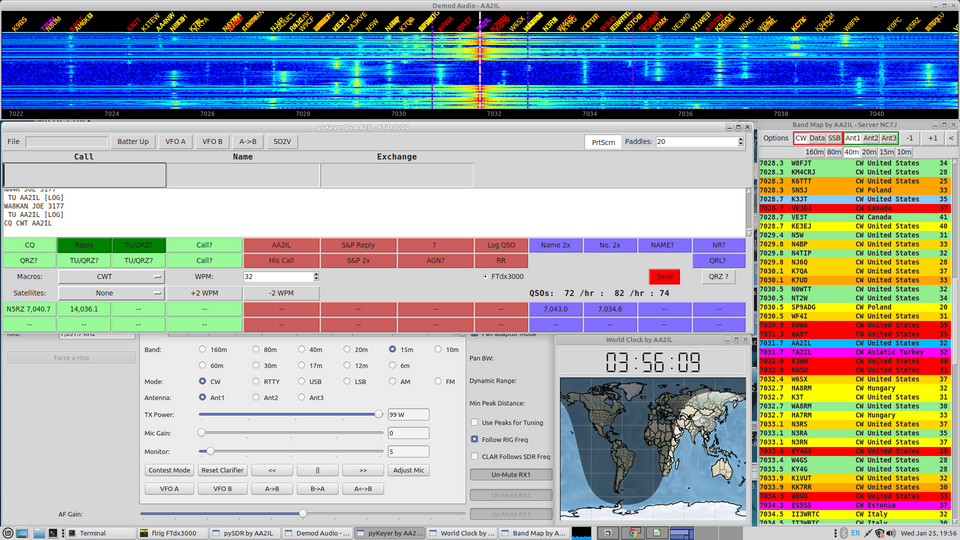

### AA2IL Repository

This repository is a collection of codes related to ham radio that I have developed over the years and regularly use in my daily operations.  Feel free to make use any of these for personal non-commercial purposes AT YOUR OWN RISK.  These codes are made available without any implied guarrentees. I only ask that proper attribution be given to the original source.  I welcome any constructive feedback and/or improvements.

To give you a taste of what these codes are all about, here is a screen shot of what I am looking at during a CW contest:

                                                                                                                                   The top panel is from an SDR connected to my rig and is a waterfall centered around my current "run" frequency.  The horizontal panel below that is the logging/keying program while the vertical panel on the right is a list of spots from the DX cluster.  At the bottom of the screen is a clock showing the current UTC time and grey-line.  Behind all of this is the controls for the SDR.

More detailed descriptions of each package and the entire suite are in the works.  Related websites include https://aa2il.github.io/ and https://www.qrz.com/db/AA2IL/

73 de AA2IL

To be continued ...

  
